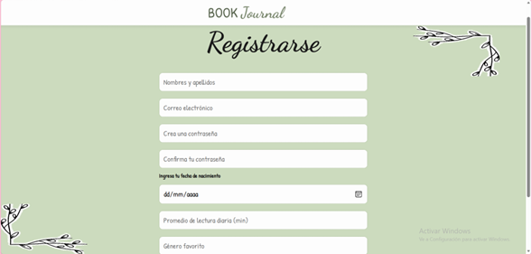
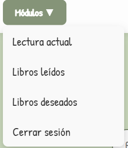
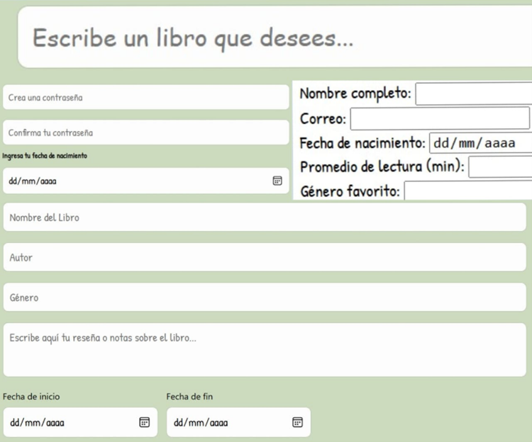

# Book-Journal
*estructura del proyecto*
```
Book-Journal/
├── frontend/                   // Interfaz de usuario y lógica de cliente
│   ├── html/                   // Vistas de la aplicación
│   │   ├── login.html          // Acceso al sistema
│   │   ├── registro.html       // Creación de nuevas cuentas
│   │   ├── perfil.html         // Datos del usuario y configuración
│   │   ├── lista_deseos.html   // Libros pendientes por leer
│   │   ├── lectura_actual.html // Seguimiento del libro en curso
│   │   ├── libros_leidos.html  // Historial y calificación (estrellas)
│   │   └── home.html           // Pantalla principal / Dashboard
│   ├── css/                    // Estilos visuales consolidados
│   │   ├── estilos.css         // Archivo unificado de estilos
│   │   └── componentes.css     // Estilos de cards, botones y estrellas
│   ├── java-script/            // Lógica de interacción y consumo de API
│   │   ├── login.js            // Validación y envío de credenciales
│   │   ├── registro.js         // Lógica de creación de usuarios
│   │   ├── historial.js        // Manejo de la lista de libros y estrellas
│   │   └── api-config.js       // Configuración de Fetch y endpoints
│   └── recursos/               // Activos estáticos y multimedia
│       ├── Imagen1.png         // Decoraciones de libros
│       ├── Imagen2.png         // Decoraciones laterales del diario
│       └── icon-perfil.png     // Avatar por defecto del usuario
├── Book-Journal/
├── backend/                   // Código fuente en Java (Spring Boot)
│   ├── src/main/java/com/bookjournal/
│   │   ├── controllers/       // Endpoints REST (@RestController)
│   │   ├── models/            // Entidades de base de datos (@Entity)
│   │   ├── repositories/      // Interfaces para consultas SQL (JPA)
│   │   ├── services/          // Lógica de negocio avanzada
│   │   └── security/          // Configuración de filtros y JWT
│   ├── src/main/resources/
│   │   └── application.properties // Configuración de conexión a PostgreSQL
│   └── pom.xml                // Dependencias de Maven
├── database/                   // Persistencia de datos (PostgreSQL)
│   ├── scripts/                // Scripts de creación de tablas y datos iniciales
│   │   ├── create_tables.sql   // Definición de tablas de usuarios y libros
│   │   └── seed_data.sql       // Datos de prueba para el desarrollo
│   └── diagramas/              // Modelo Entidad-Relación (MER)
└── README.md                   // Documentación técnica completa del proyecto
```
## Frontend Laura Lopez

Para realizar el frontend del BOOK JOURNAL se dividió la página web en 7 módulos diferentes: 


- **Login.html**: formulario para el ingreso a las pagina de Book Journal se solicita que se ingrese el correo o usuario y la contraseña además de dos botones el que da inicio de sesión y otro que dirige a la página de registro. Además, tiene una imagen de unos libros.

## Login


- **Registro.html**: formulario diseñado para capturar los datos de un nuevo usuario (nombre completo, correo electrónico, crear una contraseña, fecha de nacimiento, promedio de lectura diaria y genero favorito), tiene dos botones Finalizar registro para que se guarden los datos del formulario en la base de datos y volver para regresar a login.

## Registro


una vez dentro de la página de Book Journal hay partes que se comparten en todos los módulos. En la parte superior se encuentra una barra, en la parte izquierda se encuentra un menú desplegable en el cual se puede navegar en toda la página (lectura actual, libros leídos, libros deseados y cerrar sesión) en la mitad se encuentra el nombre de la página BOOK JOURNAL y en la parte derecha esta una imagen que funciona como un botón el cual llevara al módulo de perfil.


- **Perfil.html**: permite al usuario ver los datos que se ingresaron en el momento de registrase (nombre completo, correo electrónico, crear una contraseña, fecha de nacimiento, promedio de lectura diaria y genero favorito).

## Perfil


- **edit_perfil.html**: En este módulo el usuario podrá editar y cambiar los datos que ingreso en un principio al crear la cuenta, debe volver a llenar todos los datos desde cero.

## Editar Peril


- **Lista_deseos.html**: Formulario sencillo para el ingreso de nuevos libros a la lista de deseos, una vez ingresados los libros que se desea ver en el futuro cada libro aparecerá en una tarjeta y se permite seleccionar cuando ya se hallando leído.

## Lista Deseos


- **Lectura_actual.html**: formulario donde se ingresa los datos sobre un libro que se está leyendo en el momento (Nombre del libro, autor, genero, reseña, fecha inicio y fecha final, calificación mediante 5 estrellas interactivas). al final del formulario tiene un botón el cual permite guardar los datos del formulario y se dirige al módulo de libros leídos.

## Lectura Actual


- **Libros_leidos.html**: en este módulo se pueden visualizar los libros que ya se han agregado desde el módulo lectura actual, cada libro aparece en una tarjeta diferente y se puede borrar en caso de que haya un error o solo se quiera borrar del registro, este módulo cuenta con una barra de búsqueda, en la cual se podrá buscar dentro de la base de datos.

## Libros Leidos


Para cada uno de los módulos se creó un css personalizado a pesar de que muchas de las funciones son muy parecidas hay algunas funciones diferentes en cada módulo, a nivel general los css tiene dos fuentes (Patrick hand y dancing script), da tonalidades verdes y pone imágenes decorativas de hojas. en el caso de lectura actual y libros leídos también maneja las interacciones de colores de las estrellas, también permite visualizar mejor las fechas.

## Estilo general del cuerpo, Navbar y Menú Desplegable




## Títulos y Tipografías
  

## Inputs y Formularios


## Botones


## Cards de Libros e Historial


## Sistema de Estrellas


## Perfil e Imágenes Laterales


De la misma forma se creó un script para cada uno de nos módulos, los scripts están diseñados en lenguajes JavaScript y se realizó el manejo de estados de carga y errores, en cada uno de los módulos se diseñaron diferentes tipos de manejos de carga y errores:
1. Login.js: 
    - Validación de condiciones necesarias: Se asegura que el usuario Introduzca los datos necesarios para iniciar sesión en caso de que el usuario no lo halla hecho creara una alerta. 
 ```javascript
    if (!correo || !password) {
    alert("Completa todos los campos");
    return;
    }
 ```

   - Gestión de respuestas HTTP no exitosa: los datos pasan por la API al no coincidir con los datos que corresponden devuelve que los datos-credenciales ingresados no son correctos, por lo tanto, no fue posible iniciar sesión.
```javascript
    if (!respuesta.ok) {
    alert("Credenciales incorrectas");
    return;
    }
```

   - Captura de excepciones críticas y fallos de red: la función try-catch controla los errores inesperados que no están dentro de la lógica de l aplicación, como es el caso de la infraestructura o la conectividad. 

 ```javascript
            try {
            const respuesta = await fetch(`${API_URL}/login`, {
                method: 'POST',
                headers: {
                    'Content-Type': 'application/json'
                },
                body: JSON.stringify({ correo, password })
            });
            if (!respuesta.ok) {
                alert("Credenciales incorrectas");
                return;
            }
            const usuario = await respuesta.json();
            if (usuario) {
                // guardar sesión
                localStorage.setItem("usuarioLogueado", JSON.stringify(usuario));

                alert("Login exitoso 🎉");
                irHome();
            } else {
                alert("Credenciales incorrectas");
            }
        } catch (error) {
            console.error("Error:", error);
            alert("Error conectando con el servidor");
        }
```
2. regitro.js:
    - Validación de integridad: Es el primer control de errores dentro del registro ayuda a evitar registros incompletos,  se utiliza if (!nombre || !correo || !password || !confirmar) para poder verificar que los datos mas importantes como nombre, correo, password y la confirmación de password, en caso de que alguno falte va a enviar una alerta que indica que hay espacios vacíos.

```javascript
            if (!nombre || !correo || !password || !confirmar) {
            alert("Completa los campos obligatorios");
            return;
                }
```
   - Validación coincidencia password y confirmación de password: valida que el password y la confirmación de password sean idénticas.   
```javascript
                if (password !== confirmar) {
                    alert("Las contraseñas no coinciden");
                    return;
                }
```
   - Control de respuestas del lado del servidor: Una vez que ya se hallan enviado los datos para guardar en la base de datos, el script va a monitorear la respuesta de HTTP. En esta parte se va a validar que no hallan correos repetidos o fallos en la base de datos.
```javascript
            if (!respuesta.ok) {
                alert("Error al registrar");
                return;
            }
```
   - Gestión de excepciones de infraestructura: este manejo de errores se realiza con try-catch, y se va a encargar de cualquier fallo que ocurra mediante la ejecución de las tareas asincrónicas que no se manejan con la lógica dentro del script. 

```javascript
            try {
                const respuesta = await fetch(`${API_URL}/registro`, {
                    method: 'POST',
                    headers: {
                        'Content-Type': 'application/json'
                    },
                    body: JSON.stringify(nuevoUsuario)
                });
                if (!respuesta.ok) {
                    alert("Error al registrar");
                    return;
                }
                const usuario = await respuesta.json();
                // guardar sesión automáticamente
                localStorage.setItem("usuarioLogueado", JSON.stringify(usuario));
                alert("Registro exitoso 🎉");
                irHome();
            } catch (error) {
                console.error("Error:", error);
                alert("Error conectando con el servidor");
            }
```
3. perfil.js:
    - Validación inicio de sesión: valida que si halla una sesión iniciada previamente.
```javascript
            if (!datos) {
                alert("Debes iniciar sesión");
                irlogin();
                return;
            }
```

   - Seguridad en los datos: La pagina intenta mostrar los datos del registro pero en caso de que estén daños o incompletos el catch no deja que la pagina quede en blanco, elimina los datos erróneos y envía al usuario a iniciar sesión nuevamente de una forma segura.

```javascript
            try {
                    const usuario = JSON.parse(datos);
                    renderizarPerfil(usuario);
                } catch (error) {
                    console.error("Error al leer los datos de sesión:", error);
                    localStorage.removeItem(STORAGE_KEY);
                    window.location.href = "login.html";
                }
``` 
4. edit_perfil.js: 
    - validación inicio de sesión: para poder cambiar los datos deber haber iniciado una sesión previamente. Se asegura de que haya una sesión activa para que así los datos sean correctos y validos en la base de datos.
```javascript
            if (!datos) {
                alert("Debes iniciar sesión para editar tu perfil");
                window.location.href = "login.html";
                return;
            }
```
   - Gestión de excepciones en la carga de datos: gestiona los problemas al momento intentar comunicarse con la API. Se le informa al usuario el error con el catch puede ser un fallo de res, para que en formulario para actualizar datos quede vacío o con errores.
```javascript
            try {
                const respuesta = await fetch(`${API_URL}/${id}`);
                if (!respuesta.ok) throw new Error("Error al obtener datos de la API");
                const usuario = await respuesta.json();
                // Rellenar los campos del formulario
                document.getElementById('nombre').value = usuario.nombre || '';
                document.getElementById('correo').value = usuario.correo || '';
                document.getElementById('fechaNacimiento').value = usuario.fechaNacimiento || '';
                document.getElementById('promedioLectura').value = usuario.promedioLectura || '';
                document.getElementById('generoFavorito').value = usuario.generoFavorito || '';  
            } catch (error) {
                console.error("Error:", error);
                alert("No se pudieron cargar los datos desde el servidor.");
            }
```
   - Validación de integridad de datos: antes de actualizar los datos en la base de datos, se valida que todos los campos contengas dichos datos, en caso de que falte alguno le avisa al usuario evitando nuevos errores en los datos.
```javascript
            if (!nombre || !correo || !fechaNacimiento || !promedioLectura || !generoFavorito) {
                alert("Se deben completar todos los campos obligatoriamente");
                return;
            }
```
   - Control de estados de respuesta en la actualización: una ves se haga la actualización de los datos en la base de datos, si se confirma la operación le avisa al usuario.
```javascript
            try {
                const respuesta = await fetch(`${API_URL}/${id}`, {
                    method: 'PUT',
                    headers: {
                        'Content-Type': 'application/json'
                    },
                    body: JSON.stringify(usuarioActualizado)
                });
                if (respuesta.ok) {
                    // Actualizar también el localStorage para que el resto de la app vea los cambios
                    localStorage.setItem(STORAGE_KEY, JSON.stringify(usuarioActualizado));
                    alert("Los cambios se han guardado exitosamente en tu perfil.");
                    window.location.href = "perfil.html";
                } else {
                    alert("Hubo un error al actualizar los datos en el servidor.");
                }
            } catch (error) {
                console.error("Error en la petición:", error);
                alert("No se pudo conectar con el servidor.");
            }
```
5. lista_deseos.js:
    - Estado de carga inicial: limpia el historial e interfaz para evitar que se muestren datos erróneos o desactualizados, crea una cadena vacía para mostrar la lista de forma ordenada.
```javascript
            const contenedor = document.getElementById('lista-deseos-container');
            contenedor.innerHTML = '';
``` 
   - Gestión de errores de respuesta HTTP: valida si el servidor esta realizando los procesos correctamente, bloquea el procesamiento erroneo de los datos que dañarían la ejecución de la ampliación.
```javascript
        if (!respuesta.ok) throw new Error();
```
   - Manejo de estado de datos vacíos: en caso de que ocurra un error la pagina no queda vacía, el script le avisa al usuario y le pide que agregue libros a la lista de libros que desea leer en el futuro.
```javascript
                if (listaLibros.length === 0) {
                    contenedor.innerHTML = `
                        <p style="text-align:center;">
                            Aún no tienes libros en tu lista 📚
                        </p>`;
                    return;
                }
```
   - Captura de Excepciones de Red y Fallbacks Visuales:Se gestionan los fallos críticos por ejemplo la perdida de conexión, registra el error en el servidor y también envía un mensaje a el usuario.
```javascript
            catch (error) {
                console.error("Error cargando deseos:", error);
                contenedor.innerHTML = `<p>Error cargando datos</p>`;
            }
```
   - Validación de Entrada (Lado del Cliente): antes de que se argue algún dato se valida que si haya un titulo para agregar a la lista.
```javascript
            if (titulo === "") {
                alert("Escribe un libro");
                return;
            }
```
   - Validación error carga a la base de datos: en caso de que al cargar el nuevo libro a la lista de deseos no es correcta le va a visar al usuario.
```javascript
            try {
                await fetch(API_URL, {
                    method: 'POST',
                    headers: {
                        'Content-Type': 'application/json'
                    },
                    body: JSON.stringify({ titulo })
                });
                input.value = "";
                cargarDeseos();
            } catch (error) {
                console.error("Error guardando:", error);
            }
```
   - Eliminar y error al eliminar libro de la lista de deseos: cuando el usuario desea eliminar un libro que probablemente ya leyó, enviar un mensaje para verificar si desea eliminar, y en caso de que ocurrar un error al eliminar puede ser por falla de conexión a internet.
```javascript
            try {
                await fetch(`${API_URL}/${id}`, {
                    method: 'DELETE'
                });
                cargarDeseos();
            } catch (error) {
                console.error("Error eliminando:", error);
            }
```
6. lectura_actual.js:
   - valida de integridad datos de lectura: valida que al menos se cuente con el nombre del libro para poder guardarlo en la base de datos, además valida que no se ingresen solo espacios (carácter no valido), esto evita que se hagan acciones innecesarias con la API. En este caso devolverá un mensaje indicándole al usuario que debe escribir el nombre del libro.
```javascript
            if (nuevoLibro.titulo.trim() === "") {
                alert("Por favor, ingresa al menos el título del libro.");
                return;
            }
```
   - Control de respuesta de servidor: Permite que se identifique si como resultado a una petición a la API fue exitosa o no, en caso de que allá un error le mostrar al usuario el mensaje “Error al guardar en la API”, pero en caso de que sea exitosa arrojara el mensaje “libro guardado correctamente”. 
```javascript
                if (respuesta.ok) {
                    alert("Libro guardado correctamente en la API");
                    window.location.href = "libros_leidos.html";
                } else {
                    alert("Error al guardar en la API");
                }
```
   - Gestión de excepción de red:  maneja los errores que no se pueden son manejados por la lógica de la aplicación como la conexión a internet o API apagada, le muestra al usuario el mensaje “Error conectando con la API” esto permite que no se afecte la infraestructura y una estabilidad visual.
```javascript
            catch (error) {
                console.error("Error conectando con la API:", error);
            }
```
7. libros_leidos.js: 
   - Limpieza previa y preparación para carga: permite que la interfaz este lista para mostrar los datos nuevos cargados desde el formulario de lectura_actual.html, se crea una cadena vacía para que no se duplique la información, y también ofrece transiciones limpias.
```javascript
            const contenedor = document.getElementById('historial-libros');
```
   - Validación de respuesta del servidor: permite verificar que las peticiones sean para leer libros ya leídos o eliminar libros, se completaron con éxito en el backend, el caso de que haya un error se le informa al usuario por medio del mensaje “Error al obtener dato”, pero en caso de ser exitoso se mostrara “Libro eliminador correctamente” o si se cargaron los datos pero no se eliminó “No se pudo eliminar”.
```javascript
                if (!respuesta.ok) {
                    throw new Error("Error al obtener datos");
                }
                if (respuesta.ok) {
                    alert("Libro eliminado correctamente");
                    cargarHistorial();
                } else {
                    alert("No se pudo eliminar");
                }
```                
   - Manejo de estado para colecciones vacías: cuando todavía no se han guardados libros ya terminados, se carga un mensaje para no dejar la pagina en blanco “No hay libros leídos aun”. 
```javascript  
                if (libros.length === 0) {
                    contenedor.innerHTML = `
                        <div style="text-align:center; padding:50px;">
                            <p>No hay libros leídos aún 📚</p>
                        </div>`;
                    return;
                }
```
   - Captura de excepciones de red y conectividad: se capturan los errores que están por fuera de la lógica de la aplicación, es una red de seguridad registra el error técnico, pero envía un mensaje sencillo al usuario, permite que la pagina tenga una buena estabilidad.
```javascript
            catch (error) {
                console.error("Error conectando con la API:", error);
                contenedor.innerHTML = `<p>Error cargando datos</p>`;
            }
```
   - Control para dato incompletos: en caso que el usuario no haya rellenado los campos de autor, autor, fechas de inicio y final  y reseña enseña mensajes “desconocido” , “N/A” y “sin reseña” para no dejar el campo vacío, y así evitando que se vea incompleta la interfaz, o parezcan errores visuales.
```javascript
                <p><strong>Autor:</strong> ${libro.autor || 'Desconocido'}</p>
                <p><strong>Género:</strong> ${libro.genero || 'N/A'}</p>
                <p><strong>Fechas:</strong> ${libro.inicio} - ${libro.fin}</p>
                <p><strong>Reseña:</strong> ${libro.resena || 'Sin reseña'}</p
```

## Stack tecnologico
1. Frontend: Maneja la lógica de interacción y estilos interfaz con el cliente.
    - Lenguaje base: HTML5 para la estructura de cada pagina (login.html, registro.html, perfil.html, edit_perfil.html, lista_deseos.html, lectura_actual.html y libros_leidos.html) y css3 para el diseño visual (login.css, registro.css, perfil.css, edit_perfil.css, lista_deseos.css, lectura_actual.css y libros_leidos.css).
    - Tipografía: Integración con Google Font (Dancing Script y Patrick Hand)
    - Lógica de interfaz: JavaScript, se encara de capturar los datos y actualizarlos por medio de clicks y envíos de formularios con datos  (login.js, registro.js, perfil.js, edit_perfil.js, lista_deseos.js, lectura_actual.js y libros_leidos.js)
    - Comunicación: Fetch api, actúa como el mensajero, es quien envía los datos desde los formularios hasta el backend.

2. Backend: se encarga de procesar la lógica de negocio, gestionar la comunicación con la base de datos y garantizar la seguridad y autenticación de los datos del usuario.
    - Lenguaje: Java 
    - Framework principal: Spring Boot
    - Gestión de dependencias: Maven archivo pom.xml
    - Acceso a datos: Spring data JPA/ Hibernate, permite mapear las clases de java
    - Seguridad: Spring Security para manejo de sesiones.
    - Servidor embebido: Tomcat viene con Spring Boot para correr la aplicación.
    - Control para problemas de versiones: Se creo un Docker el cual permite que cualquier persona pueda ejecutar la aplicación sin problemas de versionamiento.

3. Base de datos: la información capturada por los formularios deja de estar solo en la aplicación y se guarda de forma permanente.
    - Motor de base de datos: PostgreSQL, para gestionar la base de datos relacionadas.
    - Lenguaje de consulta: SQL, creación de tablas, agregar registros nuevos (formularios de ingreso i edición de datos) y consultarlos (búsqueda en libros leídos).
    - Conexión red: La comunicación con el servidor se realiza mediante un túnel de datos dirigido al puerto 5432, garantizando un flujo de información constante y seguro.
    - Creación de instancia: Se configuró una instancia dedicada del motor de base de datos, proporcionando un entorno de ejecución aislado, estable y optimizado para el proyecto.

4. Despliegue:
**Instrucciones instalación local**
Este proyecto busca que a pesar de ser en la nube se pueda usar en un espacio local para desarrollo, pruebas concretas y revisión técnica del código que lo forma.

    Paso 1: clonación del proyecto saca una copia local del lugar donde está, usando este comando:

        Git clone https://github.com/paulariveros2203/book-journal.git

    Paso 2: configuración de la base de datos haz una instancia local en postgresql por medio de pgadmin. Deben correrse los scripts sql que están en la carpeta /database/scripts/ para hacer la estructura de tablas y relaciones que se necesitan para guardar libros y usuarios.

    Paso 3: ajuste de parámetros de conexión configura las claves de acceso (nombre de la base de datos, usuario y contraseña) en el archivo de propiedades del backend:

        Src/main/resources/application.properties

    Revisa que el puerto de conexión esté en el 5432 de la instancia local.

    Paso 4: despliegue del servidor usa el ciclo de vida de maven para armar el proyecto y correr la aplicación. Esto hará que el servidor de spring boot empiece a funcionar en el puerto 8080, dejando que los endpoints de la api reciban pedidos del frontend.

    Paso 5: visualización de la interfaz cuando el backend esté andando, abre el archivo login.html que está en la carpeta /frontend/html/ con un navegador web o un servidor local de desarrollo (como live server) para usar la aplicación.
